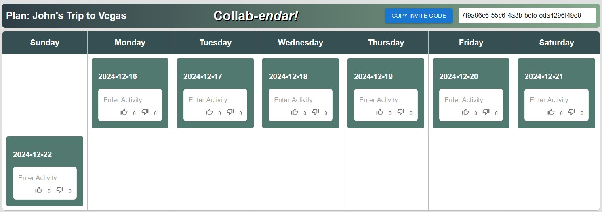
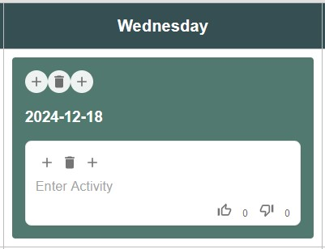

# Collab-_endar!_ 
A collaborative calendar for planning your next trip. To use the application, navigate to [https://zealous-sky-03efe470f.5.azurestaticapps.net/](https://zealous-sky-03efe470f.5.azurestaticapps.net/) which brings you to the front page of the web app. Here, there are two options: (1) create a new plan, or (2) join an existing plan with an invite code.

## Login Page

If you are creating a new plan: enter your name, a name for your plan (e.g., "John's Trip to Vegas"), and the start and end dates for your trip, then click the "create plan" button. If you are joining another user's plan (or simply returning to a previously made plan), click the "join with invite code" tab, enter your name, and the invite code, then click the "join plan" button.

Create new plan            |  Join an existing plan
:-------------------------:|:-------------------------:
  |  

## Planning Page

Upon creation of a new plan, you are prompted with a calendar view of your trip. In the top right, you can find the invite code if you wish to share with friends so that they can join. Within each day of the trip, is a single date card which contains at least one activity card. Each day can contain only one date card but can contain as many activity cards as desired. 

Hovering over a date card provides you with the following options: insert a date card on the previous day (+), delete date card from this day (🗑), insert a date card on the next day (+). When hovering over an activity card, you are given similar set of options except that they allow you to insert an activity card before the current one (+), delete the current activity card (🗑), and insert after an activity card after the current one (+).

> [!CAUTION]
> Deleting a date automatically deletes all activities on that day.

## Collaboration Features

Collab-_endar!_ lets you collaborate with others effortlessly by enabling any amount of users to be simultaneously connected to the same plan While editing an activity, after each space, or if you click away from the activity card, the text is synced to all other users currently viewing the plan. In fact, every action is immediately synced to all users viewing a plan, including activity card modification/addition/deletion, and date card addition/deletion. This way, you can effectively collaborate to plan your plan without fear of having an out of date view.

When a user is typing in an activity card, the card is locked to prevent other uses from editing it at the same time, preventing confusion. When a card is locked a small indicator on the activity card shows which user is currently editing it.

## Technologies Utilized

- `Azure SingalR` - For real-time updates across simultaneous client connections.
- `Azure CosmosDB NoSQL` - For storing all user-entered data.
- `Azure Static Web App` - For hosting this application, making it accessible in anyone's web browser.
- `Azure Functions` - Used to create the backend for this application. Consists of > 10 endpoints for handling user interactions which require accessing or changing data in CosmosDB.
